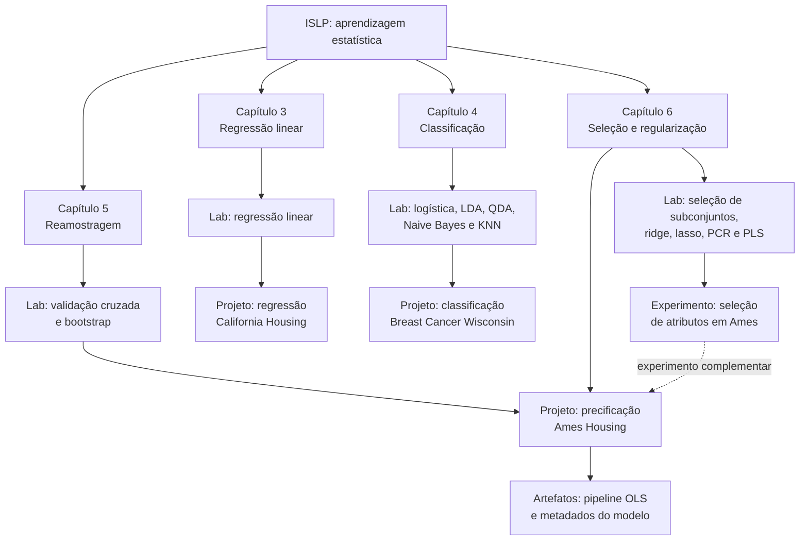

# ISLP em Prática

Este é um repositório de estudo em construção, dedicado à aprendizagem estatística a partir de *An Introduction to Statistical Learning with Applications in Python* (ISLP).

O objetivo é aprender enquanto os conceitos são aplicados em laboratórios, experimentos e projetos. O material elaborado, com auxilio de IA Generativas, busca aprofundar os fundamentos, comparar abordagens e examinar criticamente as premissas, limitações e a adequação de cada método ao problema estudado.

## Objetivos

- Estudar os métodos apresentados no ISLP com Python.
- Aprender por meio da aplicação em problemas de regressão e classificação.
- Aprofundar os fundamentos estatísticos por trás de cada abordagem.
- Analisar criticamente premissas, limitações e escolhas metodológicas.
- Conectar cada capítulo a laboratórios, experimentos e projetos aplicados.
- Comparar métodos estatísticos clássicos com pipelines do scikit-learn.
- Documentar decisões, aprendizados e artefatos reproduzíveis.

## Mapa de estudos



### Como interpretar o mapa

- O **Capítulo 3** introduz regressão linear e sustenta o projeto com California Housing.
- O **Capítulo 4** conecta modelos de classificação ao diagnóstico do conjunto Breast Cancer Wisconsin.
- O **Capítulo 5** fornece validação cruzada e bootstrap para comparar modelos sem depender de uma única divisão dos dados.
- O **Capítulo 6** conecta seleção de variáveis, regularização e redução de dimensão aos experimentos com Ames Housing.
- O projeto Ames integra os capítulos 5 e 6 em um fluxo end-to-end e persiste o modelo final em `artifacts/`.

## Trilha por capítulo

| Capítulo | Conceitos | Materiais |
| --- | --- | --- |
| **3 — Regressão linear** | <ul><li>Regressão simples e múltipla</li><li>Interações e transformações</li><li>Colinearidade e resíduos</li><li>Regularização</li></ul> | [Laboratório](cap03_lab_regressao_linear.ipynb) · [Projeto](cap03_projeto_regressao_california_housing.ipynb) |
| **4 — Classificação** | <ul><li>Regressão logística</li><li>LDA e QDA</li><li>Naive Bayes e KNN</li><li>Thresholds e análise de erros</li></ul> | [Laboratório](cap04_lab_classificacao.ipynb) · [Projeto](cap04_projeto_classificacao_cancer_mama.ipynb) |
| **5 — Reamostragem** | <ul><li>Conjunto de validação</li><li>Validação cruzada</li><li>LOOCV</li><li>Bootstrap</li></ul> | [Laboratório](cap05_lab_validacao_cruzada_bootstrap.ipynb) · [Projeto integrado](cap05_06_projeto_precificacao_ames.ipynb) |
| **6 — Seleção e regularização** | <ul><li>Seleção de subconjuntos</li><li>Ridge, lasso e elastic net</li><li>PCR e PLS</li><li>Seleção de atributos</li></ul> | [Laboratório](cap06_lab_selecao_regularizacao.ipynb) · [Lab comentado](cap06_lab_selecao_regularizacao_comentado.ipynb) · [Experimento](cap06_experimento_selecao_atributos_ames.ipynb) · [Projeto integrado](cap05_06_projeto_precificacao_ames.ipynb) |

Os arquivos CSV e demais conjuntos usados pelos laboratórios estão preservados em [`lab_chapters/`](lab_chapters/).

## Projetos e experimentos

### Regressão com California Housing

**Notebook:** [Abrir projeto](cap03_projeto_regressao_california_housing.ipynb)

Projeto didático que combina três tradições de estudo: ISLP, o MOOC do scikit-learn e a abordagem apresentada por Aurélien Géron. O fluxo principal cobre:

- formulação do problema e dicionário das variáveis;
- separação entre treino e teste antes da análise;
- baseline pela mediana;
- regressão linear comum;
- padronização e colinearidade;
- validação cruzada e curvas de aprendizado;
- ridge, lasso, elastic net e SGD;
- atributos polinomiais;
- diagnóstico de resíduos e importância por permutação.
---
### Classificação de tumores de mama

**Notebook:** [Abrir projeto](cap04_projeto_classificacao_cancer_mama.ipynb)

Projeto end-to-end com o conjunto Breast Cancer Wisconsin do scikit-learn. Compara LDA, QDA, Gaussian Naive Bayes e KNN, incluindo:

- divisão estratificada antes da EDA;
- baseline pela classe majoritária;
- pipelines mínimos por família de modelo;
- validação cruzada estratificada;
- ajuste de hiperparâmetros;
- seleção de variáveis;
- avaliação do threshold;
- análise de erros e curva de aprendizado.
---
### Experimento de seleção de atributos em Ames

**Notebook:** [Abrir experimento](cap06_experimento_selecao_atributos_ames.ipynb)

Experimento complementar sobre seleção forward e regularização no conjunto Ames Housing. O notebook explora a regra de um erro-padrão, compara modelos regularizados e avalia um subconjunto mais compacto de atributos.

Este notebook ainda não contém células Markdown de documentação e reúne imports exploratórios que podem não ser usados no fluxo final. Por isso, ele é classificado aqui como **experimento**, não como projeto final.

### Precificação end-to-end em Ames

**Notebook:** [Abrir projeto](cap05_06_projeto_precificacao_ames.ipynb)

Projeto mais abrangente do repositório. Conecta formulação do problema, auditoria dos dados, reamostragem e métodos de regularização em um único fluxo:

1. definição da decisão apoiada e das métricas;
2. separação do teste antes da exploração;
3. pipeline para variáveis numéricas e categóricas;
4. comparação entre divisão simples, k-fold, LOOCV e validação repetida;
5. seleção forward e regra de um erro-padrão;
6. ridge, lasso e elastic net;
7. PCR e PLS;
8. bootstrap para estabilidade de coeficientes;
9. validação cruzada aninhada;
10. avaliação única no teste e análise de erros;
11. persistência do modelo e de seus metadados.

O pipeline treinado e seus metadados estão em [`artifacts/ames_linear_model.joblib`](artifacts/ames_linear_model.joblib) e [`artifacts/ames_linear_model_metadata.json`](artifacts/ames_linear_model_metadata.json).

---
## Estrutura atual

```text
ISLP/
├── artifacts/                  # modelo Ames persistido e metadados
├── data/                       # cópia local do Ames Housing obtida pelo OpenML
├── lab_chapters/               # datasets usados nos laboratórios do ISLP
├── capNN_lab_*.ipynb           # laboratórios por capítulo
├── capNN_experimento_*.ipynb   # experimentos intermediários
├── capNN_projeto_*.ipynb       # projetos aplicados
├── README.md
└── requirements.txt
```

## Convenção de nomes

Os notebooks seguem a convenção:

```text
capNN_tipo_tema_dataset_variante.ext
```

Onde:

- `capNN` identifica um capítulo principal, como `cap03`;
- `capNN_MM` identifica um projeto que integra capítulos, como `cap05_06`;
- `tipo` deve ser `lab`, `experimento`, `projeto` ou `relatorio`;
- `tema` descreve a técnica central;
- `dataset` é incluído quando ajuda a distinguir projetos;
- `variante` diferencia versões com objetivos distintos, como `comentado`.

### Arquivos padronizados

| Tipo | Padrão | Exemplo |
| --- | --- | --- |
| Laboratório | `capNN_lab_tema.ipynb` | `cap04_lab_classificacao.ipynb` |
| Experimento | `capNN_experimento_tema_dataset.ipynb` | `cap06_experimento_selecao_atributos_ames.ipynb` |
| Projeto | `capNN_projeto_tema_dataset.ipynb` | `cap03_projeto_regressao_california_housing.ipynb` |
| Projeto multicapítulo | `capNN_MM_projeto_tema_dataset.ipynb` | `cap05_06_projeto_precificacao_ames.ipynb` |

## Ambiente

Os metadados dos notebooks registram Python `3.14.3`, e o artefato Ames registra scikit-learn `1.8.0`. As dependências diretas estão fixadas em [`requirements.txt`](requirements.txt) para tornar o ambiente reproduzível.

Criação de ambiente virtual no Windows:

```powershell
python -m venv .venv
.venv\Scripts\Activate.ps1
python -m pip install --upgrade pip
```

Instalação das dependências:

```powershell
python -m pip install -r requirements.txt
```

Inicie o ambiente de notebooks:

```powershell
jupyter lab
```

O arquivo de requisitos contém apenas dependências externas importadas pelos notebooks. Módulos da biblioteca padrão, como `pathlib`, `itertools`, `warnings` e `functools`, não precisam ser instalados.

## Fluxo de estudo

1. Leia o capítulo correspondente no ISLP.
2. Execute o laboratório do capítulo.
3. Refaça células importantes sem consultar a solução.
4. Compare o laboratório com o projeto aplicado do mesmo capítulo.
5. Registre hipóteses antes de observar as métricas.
6. Preserve o conjunto de teste até a escolha final.
7. Revise os erros do modelo, não apenas a métrica agregada.
8. Documente o que mudou entre o experimento e o projeto final.

## Princípios metodológicos adotados

- Separar teste antes da EDA orientada ao modelo.
- Comparar todo modelo com um baseline simples.
- Ajustar hiperparâmetros apenas nos dados de treinamento.
- Usar validação cruzada para seleção e teste uma única vez para avaliação final.
- Apresentar dispersão ou incerteza, não apenas a média das métricas.
- Avaliar métricas compatíveis com o problema e o custo dos erros.
- Diferenciar associação, capacidade preditiva e causalidade.
- Persistir junto ao modelo as versões, variáveis esperadas e métricas finais.

## Dados e artefatos

- [`lab_chapters/`](lab_chapters/) contém datasets usados nos laboratórios do livro.
- [`data/ames_openml_42165.csv`](data/ames_openml_42165.csv) é a cópia local do conjunto Ames Housing obtido pelo OpenML, ID `42165`.
- [`resumo_sweetviz.html`](resumo_sweetviz.html) contém uma exploração automatizada do conjunto Ames.
- [`artifacts/`](artifacts/) contém o pipeline treinado e o contrato de metadados do projeto Ames.

Arquivos de dados e modelos podem ser grandes. Antes de compartilhar o projeto publicamente, é importante verificar licença, origem, tamanho e necessidade de versionamento de cada artefato.

## Referências de estudo

- Gareth James, Daniela Witten, Trevor Hastie, Robert Tibshirani e Jonathan Taylor. *An Introduction to Statistical Learning with Applications in Python*.
- [Site oficial do ISLP](https://www.statlearning.com/)
- [Documentação do pacote e laboratórios ISLP](https://intro-stat-learning.github.io/ISLP/)
- [scikit-learn User Guide](https://scikit-learn.org/stable/user_guide.html)
- Aurélien Géron. *Hands-On Machine Learning with Scikit-Learn, Keras & TensorFlow*.
- Max Kuhn e Kjell Johnson. [*Feature Engineering and Selection: A Practical Approach for Predictive Models*](https://feat.engineering/).
- Max Kuhn e Kjell Johnson. [*Applied Machine Learning for Tabular Data*](https://aml4td.org/).
- Data Science Academy - Cientista de Dados 4.0

## Repositório em construção

Este material ainda está em construção. O ISLP está sendo estudado capítulo a capítulo, enquanto os laboratórios, experimentos e projetos são elaborados e revisados ao longo desse processo.

A continuidade do estudo inclui *Feature Engineering and Selection* e *Applied Machine Learning for Tabular Data*. Os conceitos e exercícios desses livros serão incorporados quando houver material prático consolidado para conectá-los à trilha atual.

## Bibliotecas e versões

| Biblioteca | Versão | Uso principal |
| --- | ---: | --- |
| Python | 3.14.3 | Runtime registrado nos metadados dos notebooks |
| NumPy | 2.4.3 | Operações numéricas e vetorização |
| pandas | 2.3.3 | Manipulação e análise de dados tabulares |
| scikit-learn | 1.8.0 | Pipelines, modelos, métricas e validação cruzada |
| Matplotlib | 3.11.1 | Visualizações base |
| seaborn | 0.13.2 | Visualizações estatísticas |
| statsmodels | 0.14.6 | Inferência e modelos estatísticos |
| ISLP | 0.4.1 | Datasets, modelos e utilitários dos laboratórios |
| l0bnb | 1.0.0 | Seleção de subconjuntos |
| optbinning | 0.21.0 | Discretização e seleção exploratória |
| JupyterLab | 4.6.3 | Execução interativa dos notebooks |
| ipykernel | 7.3.0 | Kernel Python para Jupyter |
| Sweetviz | 2.3.3 | Relatório exploratório automatizado |
| joblib | 1.5.3 | Persistência do pipeline treinado |

As versões completas e instaláveis estão em [`requirements.txt`](requirements.txt). Atualizações devem ser testadas nos laboratórios e projetos antes de alterar os pins.
